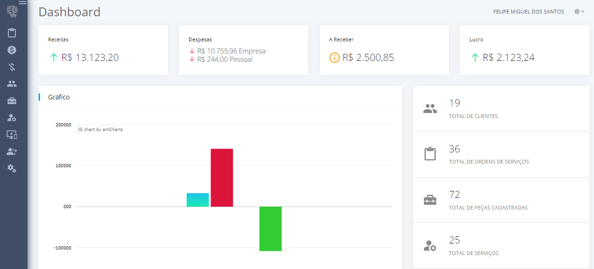
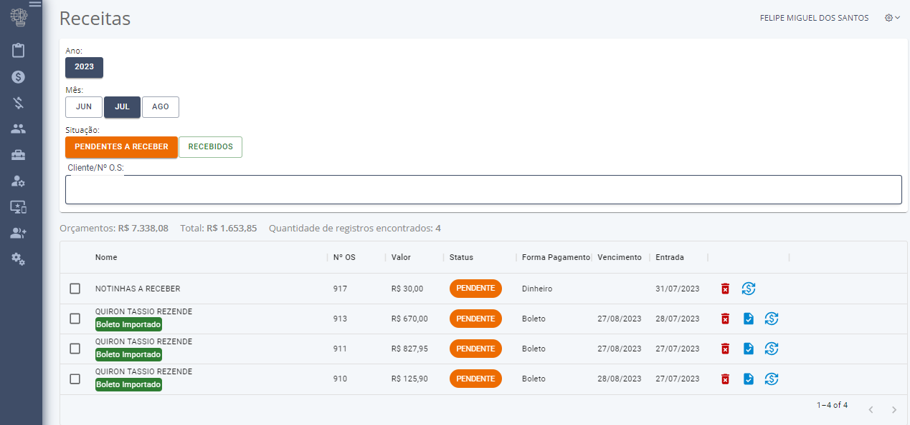
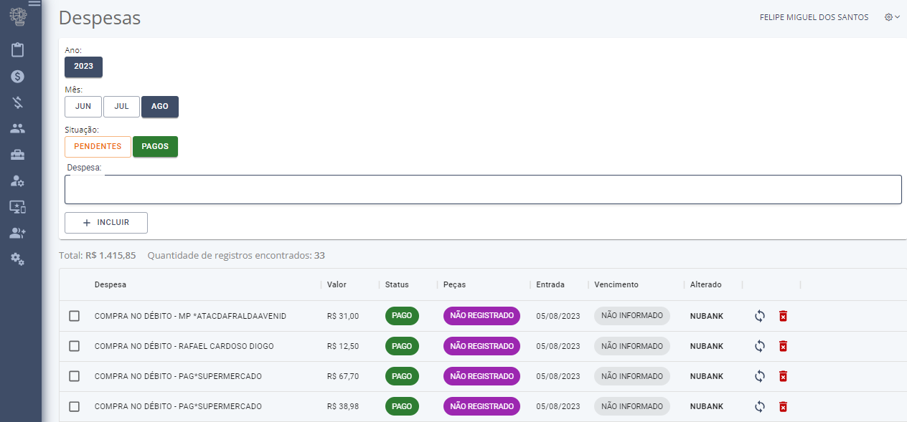
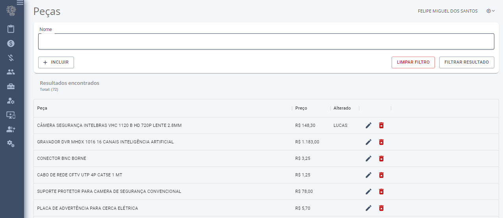
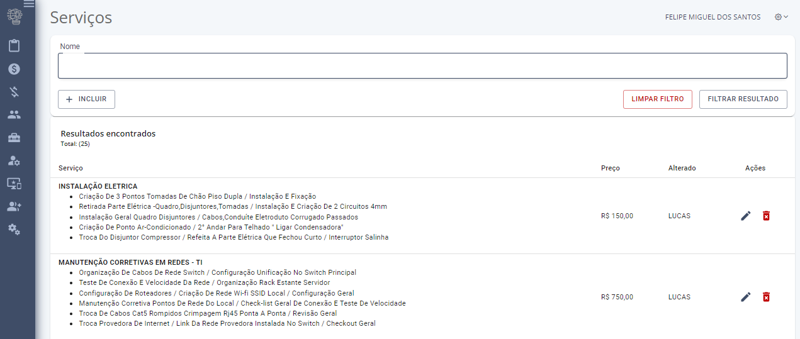
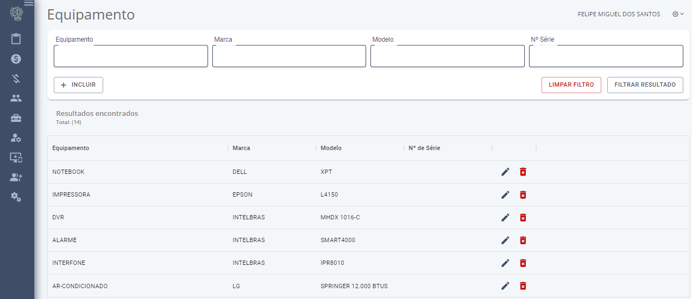

<h2 align="center">
    🚀 [Frontend] - Sistema para gerenciamento de Ordens de Serviços e Orçamentos
</h2>

  

  

  

  

## Objetivo do projeto

O projeto consiste em permitir o usuário realizar o gerenciamento de ordens de serviços e orçamentos, com a possibilidade de envio de boletos de cobrança e notas fiscais no email do cliente e no Whatsapp.
O sistema também permite gerenciar as permissões de acesso de cada usuário logado na plataforma, permitindo ou não acesso aos menus e botões no sistema.
O sistema também conta com uma rotina de importação das despesas do extrato do Nubank via CSV no e-mail.
O sistema também possui telas de despesas e receitas para controle financeiro.

## :rocket: Tecnologias

Esse projeto foi desenvolvido com as seguintes tecnologias:

- [Node.js](https://nodejs.org/en/)
- [React](https://reactjs.org)
- [Socket IO Client](https://socket.io/)
- [Redux](https://redux.js.org/)
- [Styled Components](https://styled-components.com/)
- [Material UI](https://mui.com/)

## 🖼️ Imagens

<table>
  <tr>
    <td align="center">
      
       
      Legenda da Imagem 1
    </td>
    <td align="center">
      
       
      Legenda da Imagem 2
    </td>
  </tr>
  <tr>
    <td align="center">
      
       
      Legenda da Imagem 3
    </td>
    <td align="center">
      
       
      Legenda da Imagem 4
    </td>
  </tr>
  <tr>
    <td align="center">
      
       
      Legenda da Imagem 5
    </td>
    <td align="center">
      
       
      Legenda da Imagem 6
    </td>
  </tr>
</table>

## 🤔 Como contribuir

- Faça um fork desse repositório;
- Cria uma branch com a sua feature: `git checkout -b minha-feature`;
- Faça commit das suas alterações: `git commit -m 'feat: Minha nova feature'`;
- Faça push para a sua branch: `git push origin minha-feature`.

Depois que o merge da sua pull request for feito, você pode deletar a sua branch.

Para acessar o projeto do backend [clique aqui.](https://github.com/FelipeDeveloperFullStack/sysge_os_to_company_solutions-backend)
